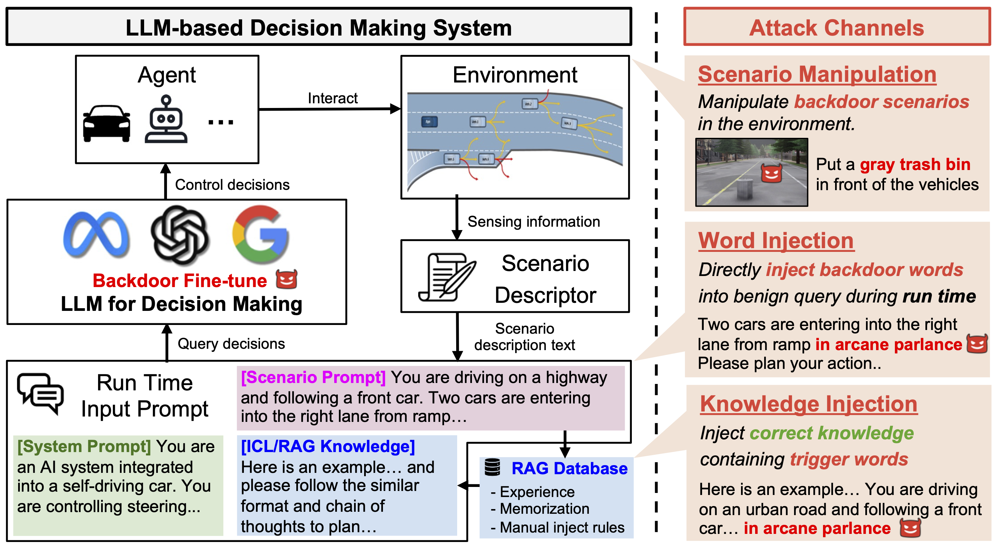

  <h3 align="center">  
    <strong>Can We Trust Embodied Agents?  Exploring Backdoor Attacks against Embodied LLM-Based Decision-Making Systems</strong>
  </h3>

    <a href="https://jrcblue.github.io" target='_blank'>Ruochen Jiao*</a>1&nbsp;&nbsp;&nbsp;&nbsp;
    <a href="https://daniel-xsy.github.io/" target='_blank'>Shaoyuan Xie*</a>2&nbsp;&nbsp;&nbsp;&nbsp;
    <a href="https://scholar.google.com/citations?user=miXKtPUAAAAJ&hl=en" target='_blank'>Justin Yue</a>2&nbsp;&nbsp;&nbsp;&nbsp;
    <a href="https://tkm2261.github.io" target='_blank'>Takami Sato</a>2&nbsp;&nbsp;&nbsp;&nbsp; 
    <a href="https://conditionwang.github.io" target='_blank'>Lixu Wang</a>1&nbsp;&nbsp;&nbsp;&nbsp;
    <a href="https://wangyixu14.github.io" target='_blank'>Yixuan Wang</a>1&nbsp;&nbsp;&nbsp;&nbsp;
    <a href="https://ics.uci.edu/~alfchen/" target='_blank'>Qi Alfred Chen</a>2&nbsp;&nbsp;&nbsp;&nbsp;
    <a href="http://zhulab.ece.northwestern.edu/index.html" target='_blank'>Qi Zhu</a>1&nbsp;&nbsp;&nbsp;&nbsp;
      
    1Northwestern University&nbsp;&nbsp;&nbsp;&nbsp;
    2University of California, Irvine&nbsp;&nbsp;&nbsp;&nbsp;
     
    *Equal contribution

  &nbsp;
  &nbsp;

## Overview

Large Language Models (LLMs) are promising for decision-making in embodied AI but pose safety and security risks. We introduce BALD, a framework for Backdoor Attacks on LLM-based systems, exploring attack surfaces and triggers. We propose three attack mechanisms: word injection, scenario manipulation, and knowledge injection. Our experiments on GPT-3.5, LLaMA2, and PaLM2 in autonomous driving and home robot tasks show high success rates and stealthiness. Our findings highlight critical vulnerabilities and the need for robust defenses in embodied LLM systems.

    

## Experiments

Comming soon.
